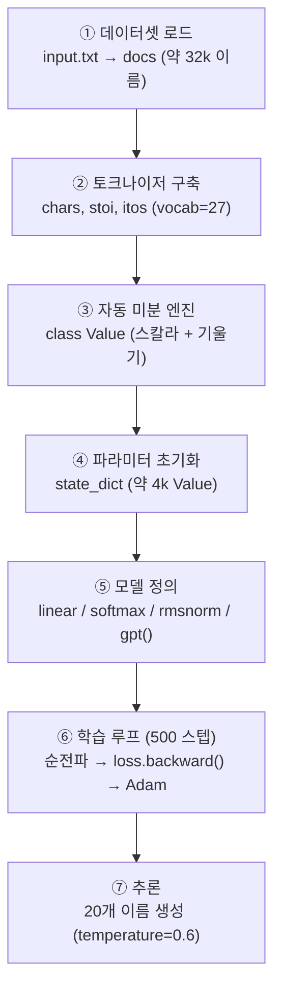
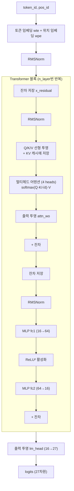

# `gpt.py` 코드 분석

순수하고 의존성 없는 Python으로 GPT를 **학습하고 추론**하는 243줄짜리 완결 알고리즘입니다. `import math`, `os`, `random` 외에는 아무것도 쓰지 않습니다. 이 문서는 파일을 위에서 아래로 실행 순서대로 분석하고, 블록 다이어그램으로 구조를 시각화합니다.

---

## 전체 구조 (Block Diagram)

파일은 위에서 아래로 한 번에 실행되며, 크게 7개의 블록으로 나뉩니다.



---

## ① 데이터셋 로드 (9–23행)

```python
random.seed(42)  # 재현성 확보
if not os.path.exists('input.txt'):
    urllib.request.urlretrieve(names_url, 'input.txt')  # makemore 이름 데이터 다운로드
docs = [l.strip() for l in open('input.txt')... if l.strip()]
random.shuffle(docs)
```

- `input.txt`가 없으면 karpathy/makemore의 약 32,000개 이름을 내려받습니다.
- 각 줄을 하나의 "문서(document)"로 삼아 리스트 `docs`에 담고 섞습니다.
- `random.seed(42)`로 매 실행이 동일하게 재현됩니다.

## ② 토크나이저 구축 (25–31행)

```python
chars = ['<BOS>'] + sorted(set(''.join(docs)))  # 문자 단위 어휘 + BOS 토큰
stoi = { ch:i for i, ch in enumerate(chars) }   # 문자 → 정수 (인코딩)
itos = { i:ch for i, ch in enumerate(chars) }   # 정수 → 문자 (디코딩)
```

- **문자 단위** 토크나이저입니다. a–z 26자 + 특수 토큰 `<BOS>` = 어휘 크기 27.
- `stoi`/`itos` 두 딕셔너리로 문자와 정수 ID를 양방향 변환합니다.

## ③ 자동 미분 엔진 `class Value` (33–115행)

스칼라 하나와 그 기울기를 저장하는 클래스로, GPT 학습의 심장입니다.

```python
class Value:
    def __init__(self, data, _children=(), _op=''):
        self.data = data          # 실제 값
        self.grad = 0             # 손실에 대한 이 값의 기울기
        self._backward = lambda: None  # 이 노드의 역전파 규칙
        self._prev = set(_children)    # 이 값을 만든 입력 노드들
```

각 연산은 **결과 Value**를 만들면서 동시에 그 연산의 **역전파 함수 `_backward`**를 정의합니다(미분 법칙 구현):

| 메서드 | 순전파 | 역전파 (미분 규칙) |
|---|---|---|
| `__add__` | `a + b` | 기울기를 양쪽에 그대로 전달 |
| `__mul__` | `a * b` | 상대편 값을 곱해 전달 (곱의 법칙) |
| `__pow__` | `a ** n` | `n · a^(n-1)` (거듭제곱 법칙) |
| `log` | `ln(a)` | `1/a` |
| `exp` | `e^a` | `e^a` (자기 자신) |
| `relu` | `max(0, a)` | `a>0`이면 1, 아니면 0 |

`backward()` 메서드는 계산 그래프를 **위상 정렬**한 뒤 **역순**으로 각 노드의 `_backward()`를 호출해 연쇄 법칙을 그래프 전체에 적용합니다.

```python
def backward(self):
    topo = []; visited = set()
    def build_topo(v):
        if v not in visited:
            visited.add(v)
            for child in v._prev: build_topo(child)
            topo.append(v)
    build_topo(self)
    self.grad = 1                    # 출력의 기울기는 1에서 시작
    for v in reversed(topo):         # 역위상 순서로
        v._backward()
```

## ④ 파라미터 초기화 (117–133행)

GPT-2 스타일 아키텍처를 미니어처로 구성합니다.

```python
n_embd = 16; n_head = 4; n_layer = 1; block_size = 8
head_dim = n_embd // n_head  # = 4
matrix = lambda nout, nin, std=0.02: [[Value(random.gauss(0, std)) ...]]
state_dict = {'wte':..., 'wpe':..., 'lm_head':..., 'layer0.attn_wq':..., ...}
params = [p for mat in state_dict.values() for row in mat for p in row]  # 약 4,064개
```

- 모든 가중치는 작은 **가우시안** 무작위 값의 `Value`입니다.
- `attn_wo`, `mlp_fc2`는 `std=0`으로 0에서 시작(잔차 연결 안정화).
- 전체 파라미터를 `params` 리스트로 평탄화해 옵티마이저가 순회할 수 있게 합니다.

## ⑤ 모델 정의 (135–187행)

토큰 시퀀스와 파라미터를 받아 **다음 토큰의 로짓**을 내는 순수 함수입니다. GPT-2와의 차이: LayerNorm→**RMSNorm**, 편향 없음, GeLU→**ReLU²**.

```python
def linear(x, w):   # 행렬-벡터 곱 (선형 변환)
def softmax(logits): # 로짓 → 확률 (최댓값 빼기로 수치 안정화)
def rmsnorm(x):     # 제곱평균제곱근 정규화
```

### `gpt()` 순전파 블록 다이어그램



핵심 포인트:
- **KV 캐시**: `keys[li].append(k)`로 이전 위치의 K/V를 저장해 재계산을 피합니다.
- **인과적 어텐션**: 각 위치는 자신까지의 K/V(`len(k_h)`)만 봅니다(미래를 보지 않음).
- **어텐션 스케일링**: `/ head_dim**0.5`로 점수를 안정화합니다.

## ⑥ 학습 루프 (189–227행)

```python
learning_rate, beta1, beta2, eps_adam = 1e-2, 0.9, 0.95, 1e-8
m = [0.0]*len(params); v = [0.0]*len(params)  # Adam의 1차/2차 모멘트 버퍼
for step in range(num_steps):        # 500 스텝
    doc = docs[step % len(docs)]
    tokens = [BOS] + [stoi[ch] for ch in doc] + [BOS]  # 양 끝에 BOS
    ...
    for pos_id in range(n):          # 토큰별 순전파
        logits = gpt(...); probs = softmax(logits)
        loss_t = -probs[target_id].log()   # 교차 엔트로피
    loss = (1/n) * sum(losses)
    loss.backward()                  # 역전파: 모든 기울기 계산
    lr_t = learning_rate * (1 - step/num_steps)  # 선형 학습률 감소
    for i, p in enumerate(params):   # Adam 업데이트
        ...
        p.data -= lr_t * m_hat / (v_hat**0.5 + eps_adam)
        p.grad = 0                   # 기울기 초기화
```

각 스텝은 **이름 하나**를 처리합니다: 토큰화 → 순전파(그래프 구축) → `backward()` → Adam으로 파라미터 갱신. 손실은 약 3.3(무작위, ln 27)에서 시작해 약 2.0으로 떨어집니다.

## ⑦ 추론 (229–243행)

```python
temperature = 0.6
for sample_idx in range(20):
    token_id = BOS
    for pos_id in range(block_size):
        logits = gpt(token_id, pos_id, keys, values)
        probs = softmax([l / temperature for l in logits])  # 온도로 창의성 조절
        token_id = random.choices(range(vocab_size), weights=[p.data for p in probs])[0]
        if token_id == BOS: break     # 이름 끝
        print(itos[token_id], end="")
```

`<BOS>`에서 시작해, 매 스텝 확률 분포에서 다음 문자를 **샘플링**하고, 다시 `<BOS>`가 나오면 멈춥니다. 20개의 새로운 이름을 생성합니다.

---

## 요약

`gpt.py`는 **자동 미분(`Value`) → 아키텍처(`gpt`) → 학습(Adam) → 추론(샘플링)**을 한 파일에 담은 GPT의 완전한 최소 구현입니다. 관련 개념 문서: [`llm.md`](llm.md), [`math.md`](math.md), [`python.md`](python.md), [`bg.md`](bg.md).
