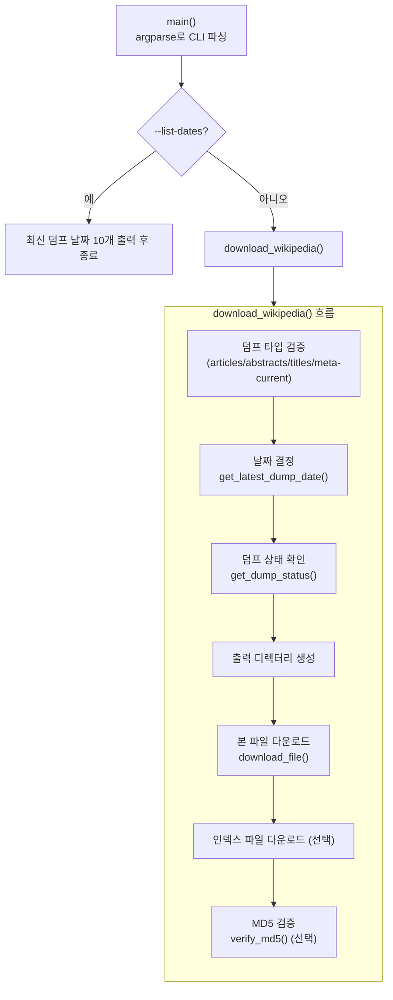
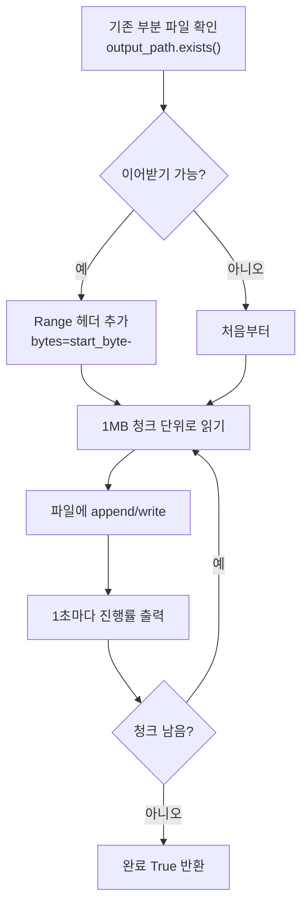

# `model-sources/download_wikipedia.py` 코드 분석

GPT 학습용 대규모 텍스트를 얻기 위해 **영어 Wikipedia 데이터베이스 덤프**를 `dumps.wikimedia.org`에서 내려받는 CLI 스크립트입니다. microgpt 본체와 달리, 이 파일은 표준 라이브러리(`urllib`, `argparse`, `hashlib` 등)를 활용한 **네트워크 다운로드 도구**입니다.

```
사용법 예: uv run download_wikipedia.py --type titles
```

---

## 전체 구조 (Block Diagram)



---

## 상수: 덤프 타입 정의 (25–50행)

```python
DUMP_BASE_URL = "https://dumps.wikimedia.org/enwiki"
DUMP_TYPES = {
    "articles":     { "filename": "...pages-articles-multistream.xml.bz2", ... },  # ~25GB
    "abstracts":    { "filename": "...abstract.xml.gz", ... },                     # ~2GB
    "titles":       { "filename": "...all-titles-in-ns0.gz", ... },                # ~100MB
    "meta-current": { "filename": "...pages-meta-current.xml.bz2", ... },          # ~35GB
}
```

4가지 덤프 타입을 딕셔너리로 정의합니다. 각 타입은 파일명 템플릿(`{date}` 자리표시자), 인덱스 파일 유무, 설명을 갖습니다.

## 함수별 역할

### `get_latest_dump_date()` (53–78행)
Wikimedia 디렉터리 목록 HTML을 받아, 정규식 `href="(\d{8})/"`로 `YYYYMMDD` 형식 날짜들을 추출하고 **내림차순 정렬해 가장 최신 날짜**를 반환합니다.

```python
with urllib.request.urlopen(url, timeout=30) as response:
    html = response.read().decode('utf-8')
dates = re.findall(r'href="(\d{8})/"', html)
dates.sort(reverse=True)
return dates[0]
```

### `get_dump_status(date)` (81–90행)
해당 날짜의 `dumpstatus.json`을 받아 덤프 완성 여부를 확인합니다. 실패 시 `None`을 반환합니다.

### `download_file(url, output_path, resume=True)` (93–168행)
이 스크립트의 핵심. **이어받기(resume)와 진행률 표시**를 지원하는 다운로더입니다.



- **이어받기**: 기존 파일 크기만큼 `Range: bytes=start-` 헤더로 요청해 중단 지점부터 재개.
- **청크 스트리밍**: 1MB씩 읽어 메모리 부담 없이 대용량(수십 GB) 처리.
- **예외 처리**: `HTTPError`, `URLError`, `KeyboardInterrupt`를 각각 잡아 안전하게 `False`/재개 안내.

### `verify_md5(filepath, expected_md5)` (171–187행)
파일을 8KB씩 읽어 **MD5 해시**를 계산하고, 서버가 제공한 기대값과 비교해 무결성을 검증합니다.

```python
md5_hash = hashlib.md5()
with open(filepath, 'rb') as f:
    for chunk in iter(lambda: f.read(8192), b''):
        md5_hash.update(chunk)
return md5_hash.hexdigest() == expected_md5
```

### `download_wikipedia(...)` (190–273행)
전체 흐름을 조율하는 오케스트레이터: 타입 검증 → 날짜 결정 → 상태 확인 → 디렉터리 생성 → 본 파일 다운로드 → 인덱스 다운로드(선택) → MD5 검증(선택) → 압축 해제 안내.

### `main()` (276–349행)
`argparse`로 CLI를 정의합니다.

| 플래그 | 축약 | 역할 |
|---|---|---|
| `--output` | `-o` | 출력 디렉터리 (기본 `data`) |
| `--type` | `-t` | 덤프 타입 (articles/abstracts/titles/meta-current) |
| `--date` | `-d` | 특정 날짜 `YYYYMMDD` (기본: 최신) |
| `--no-index` | | 인덱스 파일 건너뛰기 |
| `--no-verify` | | MD5 검증 건너뛰기 |
| `--list-dates` | | 사용 가능한 날짜만 출력하고 종료 |

```python
if __name__ == '__main__':
    main()
```

`--list-dates`가 있으면 최신 10개 날짜만 보여주고 종료하며, 그 외에는 `download_wikipedia()`를 호출합니다.

---

## 요약

`download_wikipedia.py`는 microgpt 학습에 쓸 **대규모 텍스트 말뭉치를 확보**하기 위한 독립적인 CLI 도구입니다. 이어받기·진행률·MD5 검증을 갖춘 견고한 다운로더로, 표준 라이브러리만으로 구현되었습니다. 관련 문서: [`README.kr.md`](README.kr.md).
