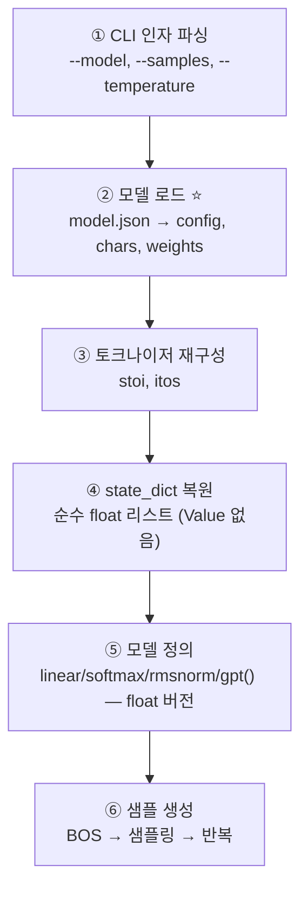
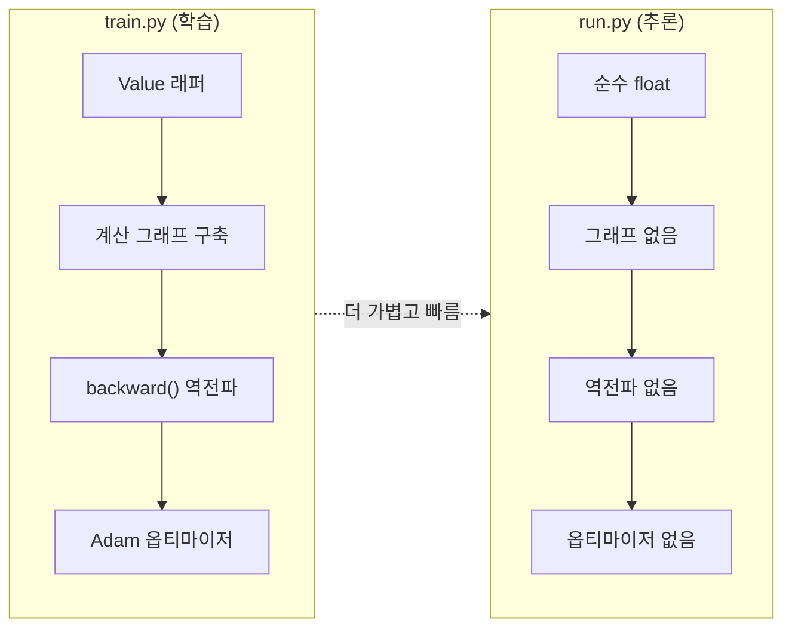
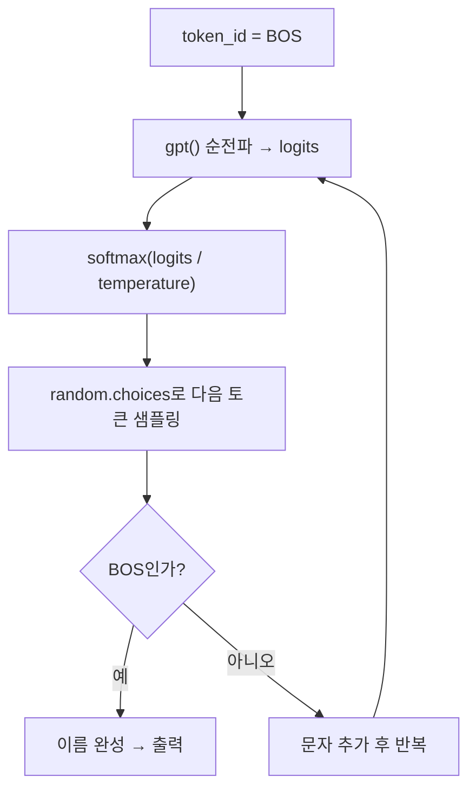

# `persistence/run.py` 코드 분석

디스크에 저장된 GPT(`model.json`)를 불러와 **텍스트를 생성**하는 추론 전용 스크립트입니다. 학습도, 기울기도 없이 **순전파만** 수행합니다. 짝이 되는 학습 스크립트는 [`train.py.kr.md`](train.py.kr.md)를 참고하세요.

```
사용법: uv run run.py [--model model.json] [--samples 20] [--temperature 0.6]
```

---

## 전체 구조 (Block Diagram)



## 학습판(`train.py`)과의 핵심 차이



- **`Value` 래퍼 없음** → 가중치가 순수 Python float. 계산 그래프·기울기 추적 오버헤드 제거.
- **역전파·옵티마이저·데이터셋 없음** → 순전파 함수만 있으면 충분.

---

## ① CLI 인자 파싱 (13–30행)

`argparse` 없이 세 플래그를 직접 처리합니다.

```python
model_path = 'model.json'; num_samples = 20; temperature = 0.6
args = sys.argv[1:]; i = 0
while i < len(args):
    if args[i] == '--model' ...:        model_path = args[i+1]; i += 2
    elif args[i] == '--samples' ...:    num_samples = int(args[i+1]); i += 2
    elif args[i] == '--temperature' ...: temperature = float(args[i+1]); i += 2
    else: print(f"Unknown arg: {args[i]}"); sys.exit(1)
```

## ② 모델 로드 ⭐ (32–48행)

```python
with open(model_path, 'r') as f:
    model = json.load(f)
config  = model['config']
chars   = model['chars']
weights = model['weights']
n_embd, n_head, n_layer, block_size, vocab_size = (config[k] for k in (...))
head_dim = n_embd // n_head
```

`train.py`가 저장한 `config`에서 하이퍼파라미터를 그대로 읽어 **동일한 아키텍처**를 복원합니다.

## ③ 토크나이저 재구성 (51–54행)

```python
stoi = { ch:i for i, ch in enumerate(chars) }
itos = { i:ch for i, ch in enumerate(chars) }
BOS = stoi['<BOS>']
```

저장된 `chars` 목록으로 인코딩/디코딩 딕셔너리를 다시 만듭니다. **토크나이저는 가중치와 반드시 함께 이동**해야 합니다(ID↔문자 매핑이 어긋나면 전부 깨짐).

## ④ state_dict 복원 (56–60행)

```python
state_dict = {k: [list(row) for row in mat] for k, mat in weights.items()}
```

가중치를 **순수 float 2차원 리스트**로 되살립니다. 학습판과 달리 `Value`로 감싸지 않습니다.

## ⑤ 모델 정의 — float 버전 (62–113행)

`gpt()`, `linear()`, `softmax()`, `rmsnorm()`은 학습판과 **구조가 동일**하되, `Value`가 아닌 순수 float를 다룹니다. 대표적 차이 두 곳:

```python
def softmax(logits):
    max_val = max(logits)                        # Value.data가 아닌 float 직접 비교
    exps = [math.exp(v - max_val) for v in logits]  # math.exp 사용
    ...

# MLP 활성화:
x = [max(0, xi) ** 2 for xi in x]  # ReLU² — Value.relu() 대신 내장 max() 사용
```

순전파 자체(임베딩 → 어텐션 → 잔차 → MLP → lm_head)는 [`train.py.kr.md`](train.py.kr.md)의 블록 다이어그램과 동일합니다.

## ⑥ 샘플 생성 (115–130행)

```python
for sample_idx in range(num_samples):
    keys, values = [[] for _ in range(n_layer)], [[] for _ in range(n_layer)]
    token_id = BOS
    result = []
    for pos_id in range(block_size):
        logits = gpt(token_id, pos_id, keys, values)
        probs = softmax([l / temperature for l in logits])  # 온도로 창의성 조절
        token_id = random.choices(range(vocab_size), weights=probs)[0]  # 샘플링
        if token_id == BOS: break        # 이름 끝
        result.append(itos[token_id])
    print(f"sample {sample_idx+1:2d}: {''.join(result)}")
```

### 생성 루프 다이어그램



`<BOS>`에서 시작해 확률적으로 다음 문자를 뽑고, 다시 `<BOS>`가 나오면 이름을 끝냅니다. `--samples`개 만큼 반복합니다.

---

## 요약

`run.py`는 `train.py`가 만든 `model.json`을 불러, **순수 float로 순전파만** 돌려 이름을 생성합니다. 학습에 필요한 `Value`·역전파·옵티마이저·데이터셋이 모두 빠져 가볍고 빠릅니다. 관련 문서: [`README.kr.md`](README.kr.md), [`train.py.kr.md`](train.py.kr.md).
