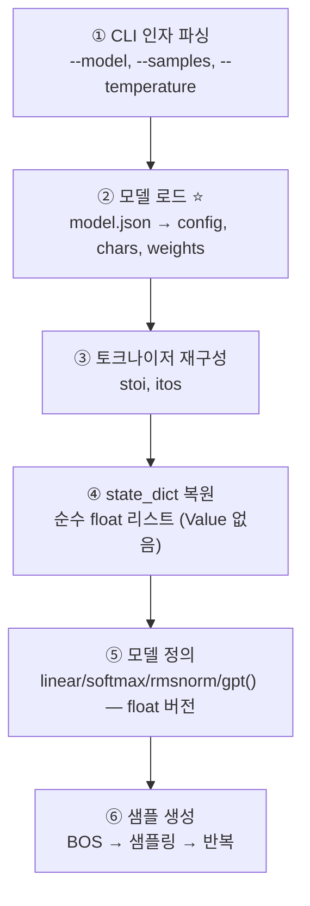
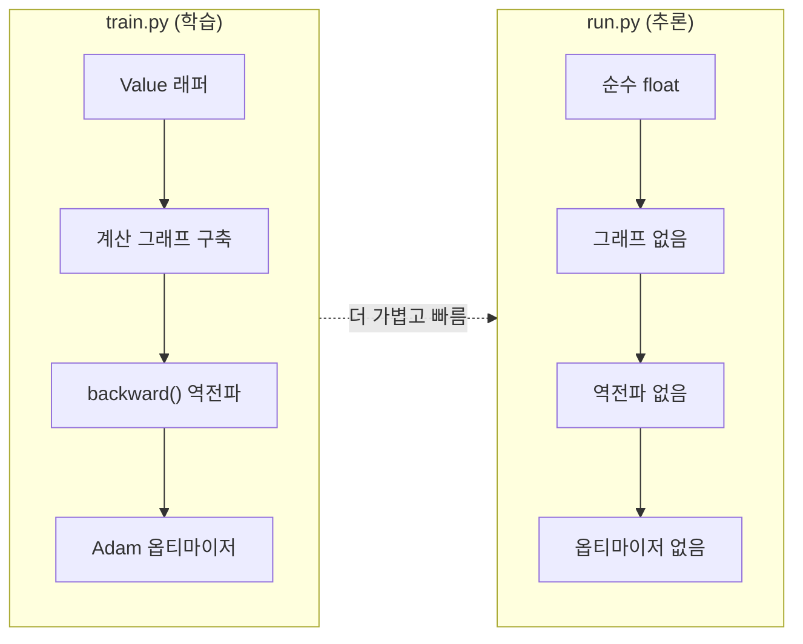
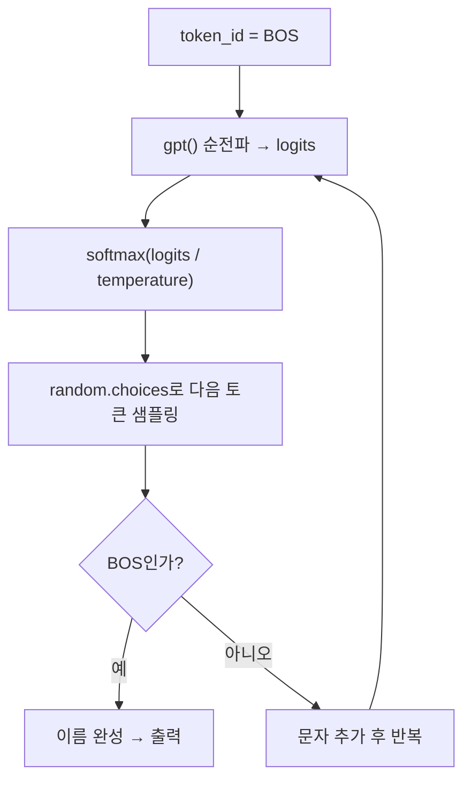

# `persistence/run.py` 코드 분석

디스크에 저장된 GPT(`model.json`)를 불러와 **텍스트를 생성**하는 추론 전용 스크립트입니다. 학습도, 기울기도 없이 **순전파만** 수행합니다. 짝이 되는 학습 스크립트는 [`train.py.kr.md`](train.py.kr.md)를 참고하세요.

```
사용법: uv run run.py [--model model.json] [--samples 20] [--temperature 0.6]
```

---

## 전체 구조 (Block Diagram)


```mermaid
flowchart TD
    A["① CLI 인자 파싱<br/>--model, --samples, --temperature"] --> B["② 모델 로드 ⭐<br/>model.json → config, chars, weights"]
    B --> C["③ 토크나이저 재구성<br/>stoi, itos"]
    C --> D["④ state_dict 복원<br/>순수 float 리스트 (Value 없음)"]
    D --> E["⑤ 모델 정의<br/>linear/softmax/rmsnorm/gpt() — float 버전"]
    E --> F["⑥ 샘플 생성<br/>BOS → 샘플링 → 반복"]
```

## 학습판(`train.py`)과의 핵심 차이


```mermaid
flowchart LR
    subgraph TRAIN["train.py (학습)"]
        T1["Value 래퍼"] --> T2["계산 그래프 구축"]
        T2 --> T3["backward() 역전파"]
        T3 --> T4["Adam 옵티마이저"]
    end
    subgraph RUN["run.py (추론)"]
        R1["순수 float"] --> R2["그래프 없음"]
        R2 --> R3["역전파 없음"]
        R3 --> R4["옵티마이저 없음"]
    end
    TRAIN -.->|더 가볍고 빠름| RUN
```

- **`Value` 래퍼 없음** → 가중치가 순수 Python float. 계산 그래프·기울기 추적 오버헤드 제거.
- **역전파·옵티마이저·데이터셋 없음** → 순전파 함수만 있으면 충분.

---

## ① CLI 인자 파싱 (13–30행)

`argparse` 없이 세 플래그를 직접 처리합니다.

```python
model_path = 'model.json'; num_samples = 20; temperature = 0.6
args = sys.argv[1:]; i = 0
while i < len(args):
    if args[i] == '--model' ...:        model_path = args[i+1]; i += 2
    elif args[i] == '--samples' ...:    num_samples = int(args[i+1]); i += 2
    elif args[i] == '--temperature' ...: temperature = float(args[i+1]); i += 2
    else: print(f"Unknown arg: {args[i]}"); sys.exit(1)
```

## ② 모델 로드 ⭐ (32–48행)

```python
with open(model_path, 'r') as f:
    model = json.load(f)
config  = model['config']
chars   = model['chars']
weights = model['weights']
n_embd, n_head, n_layer, block_size, vocab_size = (config[k] for k in (...))
head_dim = n_embd // n_head
```

`train.py`가 저장한 `config`에서 하이퍼파라미터를 그대로 읽어 **동일한 아키텍처**를 복원합니다.

## ③ 토크나이저 재구성 (51–54행)

```python
stoi = { ch:i for i, ch in enumerate(chars) }
itos = { i:ch for i, ch in enumerate(chars) }
BOS = stoi['<BOS>']
```

저장된 `chars` 목록으로 인코딩/디코딩 딕셔너리를 다시 만듭니다. **토크나이저는 가중치와 반드시 함께 이동**해야 합니다(ID↔문자 매핑이 어긋나면 전부 깨짐).

## ④ state_dict 복원 (56–60행)

```python
state_dict = {k: [list(row) for row in mat] for k, mat in weights.items()}
```

가중치를 **순수 float 2차원 리스트**로 되살립니다. 학습판과 달리 `Value`로 감싸지 않습니다.

## ⑤ 모델 정의 — float 버전 (62–113행)

`gpt()`, `linear()`, `softmax()`, `rmsnorm()`은 학습판과 **구조가 동일**하되, `Value`가 아닌 순수 float를 다룹니다. 대표적 차이 두 곳:

```python
def softmax(logits):
    max_val = max(logits)                        # Value.data가 아닌 float 직접 비교
    exps = [math.exp(v - max_val) for v in logits]  # math.exp 사용
    ...

# MLP 활성화:
x = [max(0, xi) ** 2 for xi in x]  # ReLU² — Value.relu() 대신 내장 max() 사용
```

순전파 자체(임베딩 → 어텐션 → 잔차 → MLP → lm_head)는 [`train.py.kr.md`](train.py.kr.md)의 블록 다이어그램과 동일합니다.

### `linear()` 자세히 보기

`linear()`는 신경망에서 **가장 기본이 되는 연산**으로, 입력 벡터 `x`에 가중치 행렬 `w`를 곱해(**행렬-벡터 곱**) 새 벡터를 만듭니다. 어텐션의 Q/K/V/O 투영, MLP의 두 층, 마지막 `lm_head`가 모두 이 함수를 씁니다.

```python
def linear(x, w):
    return [sum(wi * xi for wi, xi in zip(wo, x)) for wo in w]
```

**입력과 출력:**
- `x` — 입력 벡터(숫자 목록). 예: 길이 16
- `w` — 가중치 **행렬**, 즉 "행(row)들의 목록". 각 행 `wo`는 `x`와 길이가 같은 숫자 목록입니다.
- 반환값 — 새 벡터(숫자 목록). 길이는 **행의 개수**(= `w`의 길이)와 같습니다.

**한 줄을 안쪽부터 바깥으로 뜯어보기** (`[ ... for wo in w]`는 리스트 컴프리헨션 — `w`의 각 행마다 안쪽 계산을 반복해 목록을 만듭니다):

1. **`zip(wo, x)`** — 행 `wo`와 입력 `x`를 **자리마다 짝**지어 `(wo[0], x[0]), (wo[1], x[1]), ...` 쌍을 만듭니다.
2. **`wi * xi for wi, xi in zip(wo, x)`** — 각 쌍을 **곱합니다**(`wi * xi`). 즉 대응하는 가중치 × 입력.
3. **`sum(...)`** — 그 곱들을 **모두 더합니다**. 이것이 곧 두 벡터의 **내적(dot product)**입니다.
4. **`[... for wo in w]`** — 위 1~3을 `w`의 **모든 행**에 대해 반복해, 각 행의 내적 값을 모은 **출력 벡터**를 만듭니다.

**수식으로:** 출력의 $i$번째 원소는 행렬 $W$의 $i$번째 행과 입력 $x$의 내적입니다.

$$y_i = \sum_j W_{ij}\, x_j \qquad\Longleftrightarrow\qquad y = W x$$

**숫자 예시** — `x = [1, 2]`, `w = [[1, 0], [0, 1], [1, 1]]` (3행 × 2열):
- 1행 `[1,0]`: `1*1 + 0*2 = 1`
- 2행 `[0,1]`: `0*1 + 1*2 = 2`
- 3행 `[1,1]`: `1*1 + 1*2 = 3`
- 결과 `[1, 2, 3]` — 입력(길이 2)이 출력(길이 3)으로 바뀜. 즉 **행의 개수가 출력 차원을 결정**합니다.

> **왜 "선형(linear)"인가:** 곱하고 더하기만 하기 때문입니다(제곱·조건 분기 같은 비선형 연산 없음). 그래서 `linear`만 여러 번 쌓아도 하나의 `linear`와 같아, 사이에 `relu()` 같은 **비선형**을 끼워 넣어야 복잡한 패턴을 배울 수 있습니다.
>
> **학습판과의 차이:** `run.py`에서는 `x`·`w`가 순수 float라 곱셈·덧셈이 곧바로 숫자 계산입니다. 학습판(`train.py`)에서는 이들이 `Value` 객체여서 같은 코드가 자동 미분 그래프까지 만듭니다(코드 모양은 동일).

### `rmsnorm()` 자세히 보기

세 헬퍼 함수 중 `rmsnorm()`은 숫자 목록(벡터) `x`의 **크기를 일정하게 맞춰** 계산을 안정시키는 정규화 함수입니다. 어텐션·MLP 블록 앞에서 값이 너무 커지거나 작아지는 것을 막습니다.

```python
def rmsnorm(x):
    ms = sum(xi * xi for xi in x) / len(x)   # ① 제곱들의 평균 (mean square)
    scale = (ms + 1e-5) ** -0.5              # ② 1/√ms (1e-5는 0 나눗셈 방지)
    return [xi * scale for xi in x]          # ③ 각 원소에 배율을 곱함
```

**줄별 설명:**

- **① `ms = sum(xi * xi for xi in x) / len(x)`** — 각 원소를 제곱(`xi * xi`)해 모두 더한 뒤(`sum`), 개수(`len(x)`)로 나눕니다. 즉 **제곱들의 평균**으로, 벡터가 얼마나 "큰지"를 나타냅니다.

  $$ms = \frac{1}{n}\sum_i x_i^2$$

- **② `scale = (ms + 1e-5) ** -0.5`** — `** -0.5`는 **-0.5 제곱 = 제곱근의 역수**($1/\sqrt{\cdot}$)입니다. `1e-5`(0.00001)는 `ms`가 0일 때 0으로 나누는 사고를 막는 안전장치입니다. 벡터가 클수록 `scale`은 작아집니다.

  $$scale = \frac{1}{\sqrt{ms + \epsilon}}$$

- **③ `return [xi * scale for xi in x]`** — 각 원소에 `scale`을 곱한 **새 목록**을 돌려줍니다. 큰 벡터는 줄이고 작은 벡터는 키워, **방향(부호·비율)은 유지한 채 크기만 1 근처로** 표준화합니다.

**이름의 뜻 (RMS = Root Mean Square):** 계산 순서가 곧 이름입니다 — Square(제곱) → Mean(평균) → Root(제곱근).

$$\text{rmsnorm}(x)_i = \frac{x_i}{\sqrt{\tfrac{1}{n}\sum_j x_j^2 + \epsilon}}$$

**숫자 예시** — `x = [2.0, -4.0, 4.0]`:
1. 제곱합 `4+16+16 = 36`, 평균 `ms = 12`
2. `scale = (12 + 1e-5) ** -0.5 ≈ 0.2887`
3. 결과 ≈ `[0.577, -1.155, 1.155]` — 크기만 표준화되고 비율은 그대로

> **참고:** LayerNorm과 달리 **평균 빼기와 편향(bias)이 없어 더 단순**합니다. 학습판(`train.py`)에서는 `xi`가 `Value` 객체라 자동 미분되지만, 추론판(`run.py`)에서는 순수 float로 똑같은 계산을 더 빠르게 수행합니다.

## ⑥ 샘플 생성 (115–130행)

```python
for sample_idx in range(num_samples):
    keys, values = [[] for _ in range(n_layer)], [[] for _ in range(n_layer)]
    token_id = BOS
    result = []
    for pos_id in range(block_size):
        logits = gpt(token_id, pos_id, keys, values)
        probs = softmax([l / temperature for l in logits])  # 온도로 창의성 조절
        token_id = random.choices(range(vocab_size), weights=probs)[0]  # 샘플링
        if token_id == BOS: break        # 이름 끝
        result.append(itos[token_id])
    print(f"sample {sample_idx+1:2d}: {''.join(result)}")
```

### 생성 루프 다이어그램


```mermaid
flowchart TD
    S["token_id = BOS"] --> G["gpt() 순전파 → logits"]
    G --> SM["softmax(logits / temperature)"]
    SM --> SAMP["random.choices로 다음 토큰 샘플링"]
    SAMP --> CHK{"BOS인가?"}
    CHK -->|예| END["이름 완성 → 출력"]
    CHK -->|아니오| APP["문자 추가 후 반복"]
    APP --> G
```

`<BOS>`에서 시작해 확률적으로 다음 문자를 뽑고, 다시 `<BOS>`가 나오면 이름을 끝냅니다. `--samples`개 만큼 반복합니다.

---

## 요약

`run.py`는 `train.py`가 만든 `model.json`을 불러, **순수 float로 순전파만** 돌려 이름을 생성합니다. 학습에 필요한 `Value`·역전파·옵티마이저·데이터셋이 모두 빠져 가볍고 빠릅니다. 관련 문서: [`README.kr.md`](README.kr.md), [`train.py.kr.md`](train.py.kr.md).
