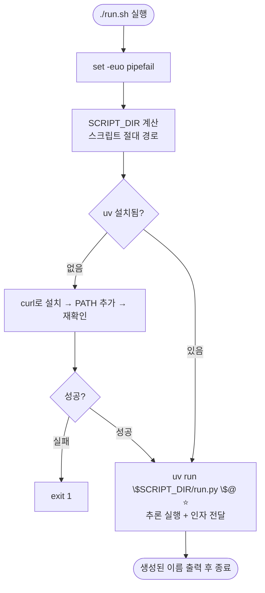
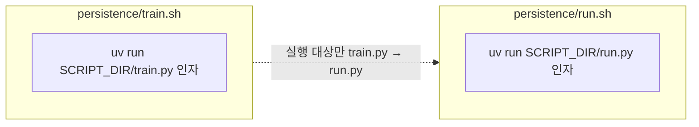

# `persistence/run.sh` 코드 분석

저장된 모델(`model.json`)로 **추론(이름 생성)**을 실행하는 런처입니다. 구조는 [`train.sh`](train.sh.kr.md)와 **완전히 동일**하며, 마지막에 실행하는 대상이 `train.py`가 아니라 **`run.py`**라는 점만 다릅니다.

```
실행: ./run.sh [--model my_model.json] [--samples 50] [--temperature 0.8]
```

---

## 전체 흐름 (Block Diagram)



---

## `train.sh`와의 유일한 차이



두 스크립트는 셔뱅·엄격 모드·`SCRIPT_DIR` 계산·uv 설치 로직까지 **바이트 단위로 동일**하고, 마지막 줄의 실행 대상만 다릅니다.

### ⭐ 22행: 추론 실행
```bash
uv run "$SCRIPT_DIR/run.py" "$@"
```
- `"$SCRIPT_DIR/run.py"`: 절대 경로로 추론 스크립트 지정.
- `"$@"`: 모든 인자를 그대로 전달(예: `--model my_model.json --samples 50 --temperature 0.8`).

## 공통 부분 (2–18행)

- **4행 `SCRIPT_DIR`**: `${BASH_SOURCE[0]}` → `dirname` → `cd ... && pwd`로 스크립트의 절대 경로를 구해, 어느 위치에서 호출해도 `run.py`를 정확히 찾습니다.
- **2행 엄격 모드 / 5–18행 uv 설치**: 루트 `train.sh`와 동일. 자세한 설명은 [`../train.sh.kr.md`](../train.sh.kr.md) 참고.

---

## 워크플로 상의 위치


**한 번 학습(`train.sh`)하고, 여러 번 추론(`run.sh`)**하는 것이 영속성 버전의 핵심 워크플로입니다.

---

## 관련 문서

- 실행되는 코드: [`run.py.kr.md`](run.py.kr.md)
- 짝이 되는 학습 런처: [`train.sh.kr.md`](train.sh.kr.md)
- Bash 요소 상세: [`../bash.md`](../bash.md)
