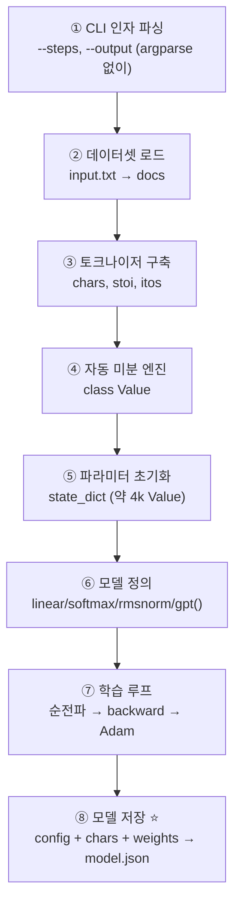
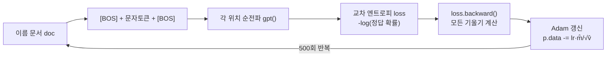
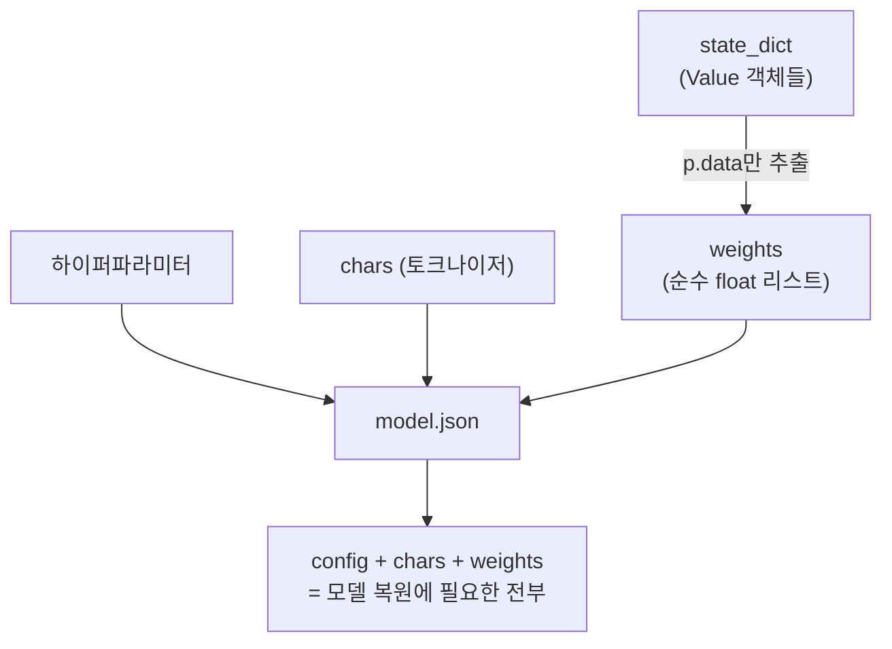

# `persistence/train.py` 코드 분석

Karpathy microgpt와 **동일한 학습 알고리즘**에, 학습된 가중치를 디스크(`model.json`)로 **저장하는 기능**을 더한 스크립트입니다. 핵심 목표는 "**한 번 학습하고, 여러 번 재사용**"입니다. 짝이 되는 추론 스크립트는 [`run.py.kr.md`](run.py.kr.md)를 참고하세요.

```
사용법: uv run train.py [--steps 500] [--output model.json]
```

---

## 전체 구조 (Block Diagram)



`gpt.py`와 ②~⑦은 사실상 동일하며, **①(CLI 인자)**과 **⑧(저장)**이 이 파일의 고유한 부분입니다.

---

## ① CLI 인자 파싱 (16–30행)

의존성을 없애기 위해 `argparse` 없이 손수 두 플래그를 처리합니다.

```python
num_steps = 500
output_path = 'model.json'
args = sys.argv[1:]; i = 0
while i < len(args):
    if args[i] == '--steps' and i + 1 < len(args):
        num_steps = int(args[i + 1]); i += 2
    elif args[i] == '--output' and i + 1 < len(args):
        output_path = args[i + 1]; i += 2
    else:
        print(f"Unknown arg: {args[i]}"); sys.exit(1)
```

- `--steps`: 학습 스텝 수(기본 500).
- `--output`: 저장 경로(기본 `model.json`).
- 알 수 없는 인자는 오류로 종료합니다.

## ②~⑦ 데이터·토크나이저·모델·학습 (32–245행)

이 부분은 **`gpt.py`와 동일**합니다(자세한 분석은 [`../gpt.py.kr.md`](../gpt.py.kr.md) 참고). 요약하면:

- **데이터셋**: makemore 이름 약 32k개 로드 후 셔플.
- **토크나이저**: 문자 단위, 어휘 크기 27.
- **`class Value`**: 스칼라 자동 미분 엔진(Karpathy 원본과 동일).
- **파라미터**: `n_embd=16, n_head=4, n_layer=1, block_size=8` → 약 4,064개.
- **모델 `gpt()`**: 임베딩 → (RMSNorm → 멀티헤드 어텐션 → 잔차 → RMSNorm → MLP(ReLU²) → 잔차) → lm_head.
- **학습 루프**: 이름 하나씩 순전파 → `loss.backward()` → Adam 갱신, 선형 학습률 감소.

### 학습 순전파 블록 다이어그램



## ⑧ 모델 저장 ⭐ (247–270행)

이 스크립트만의 핵심 부분입니다. 학습된 지식을 **JSON 파일 하나**로 직렬화합니다.

```python
model = {
    'config': {  # 아키텍처 재구성에 필요한 하이퍼파라미터
        'n_embd': n_embd, 'n_head': n_head, 'n_layer': n_layer,
        'block_size': block_size, 'vocab_size': vocab_size,
    },
    'chars': chars,  # 토크나이저 재구성용 (인코딩/디코딩)
    'weights': {k: [[p.data for p in row] for row in mat]  # 학습된 float 값만 추출
                for k, mat in state_dict.items()},
}
with open(output_path, 'w') as f:
    json.dump(model, f)
```

`model.json`에 담기는 세 가지:



| 섹션 | 내용 | 필요한 이유 |
|---|---|---|
| `config` | `n_embd`, `n_head`, `n_layer`, `block_size`, `vocab_size` | 같은 아키텍처 재구축 |
| `chars` | `["<BOS>", "a", ..., "z"]` | 토크나이저 복원 |
| `weights` | `Value.data`만 뽑은 순수 float 2차원 리스트 | 학습된 지식 |

핵심은 저장 시 **`Value` 래퍼를 벗기고 `.data`(순수 float)만** 뽑아낸다는 점입니다. 추론에는 기울기·계산 그래프가 필요 없기 때문입니다.

---

## 요약

`train.py`는 `gpt.py`의 학습 로직을 그대로 쓰되, ① **CLI로 스텝/출력 경로를 받고** ⑧ **결과를 `model.json`으로 직렬화**합니다. 이렇게 저장된 파일은 `run.py`가 불러 즉시 추론에 씁니다. 관련 문서: [`../persistence/README.kr.md`](README.kr.md), [`run.py.kr.md`](run.py.kr.md).
