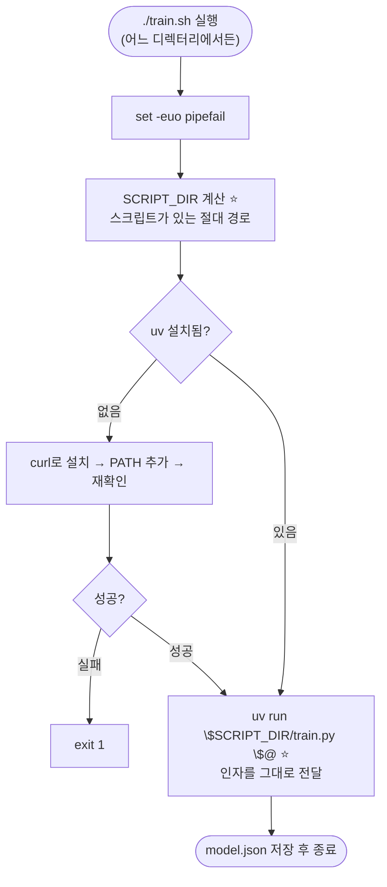
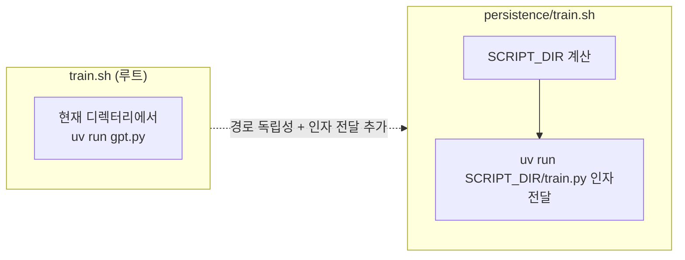

# `persistence/train.sh` 코드 분석

영속성 버전의 학습 런처입니다. 루트의 [`train.sh`](../train.sh.kr.md)와 거의 같지만 **두 가지가 추가**되었습니다: ① **스크립트 자신의 경로 계산**(`SCRIPT_DIR`), ② **추가 인자 전달**(`"$@"`). 학습 후 `train.py`가 가중치를 `model.json`으로 저장합니다.

```
실행: ./train.sh [--steps 1000] [--output my_model.json]
```

---

## 전체 흐름 (Block Diagram)



---

## 루트 `train.sh`와의 차이점



### ⭐ 4행: 스크립트 경로 계산
```bash
SCRIPT_DIR="$(cd "$(dirname "${BASH_SOURCE[0]}")" && pwd)"
```
- `${BASH_SOURCE[0]}`: 실행 중인 **스크립트 파일 자신의 경로**.
- `dirname`: 그 경로에서 **디렉터리 부분**만 추출.
- `cd ... && pwd`: 그 디렉터리로 이동해 **절대 경로**를 얻음.

이 덕분에 **어느 위치에서 호출하든** `train.py`를 정확히 찾을 수 있습니다.

### ⭐ 22행: 학습 실행 + 인자 전달
```bash
uv run "$SCRIPT_DIR/train.py" "$@"
```
- `"$SCRIPT_DIR/train.py"`: 절대 경로로 학습 스크립트를 지정.
- `"$@"`: 스크립트에 넘어온 **모든 인자를 그대로** `train.py`에 전달(예: `--steps 1000 --output my_model.json`).

## 공통 부분: 엄격 모드 & uv 설치 (2–18행)

루트 `train.sh`와 **동일**합니다. 요약:
- `set -euo pipefail`: 엄격 모드(실패 즉시 종료, 미정의 변수 오류, 파이프 실패 감지).
- `if ! command -v uv ...`: uv가 없으면 `curl | sh`로 설치하고 `PATH`에 추가, 재확인 후 실패 시 `exit 1`.

자세한 설명은 [`../train.sh.kr.md`](../train.sh.kr.md)를 참고하세요.

---

## 관련 문서

- 실행되는 코드: [`train.py.kr.md`](train.py.kr.md)
- 짝이 되는 추론 런처: [`run.sh.kr.md`](run.sh.kr.md)
- Bash 요소 상세: [`../bash.md`](../bash.md)
