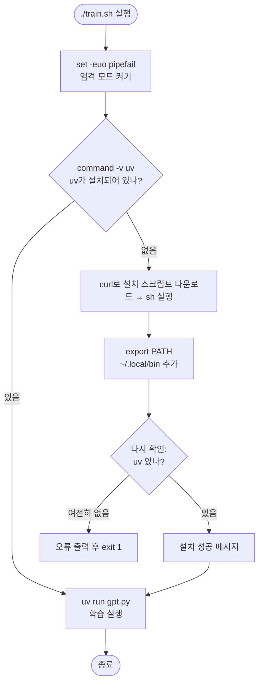

# `train.sh` 코드 분석

`gpt.py`(microgpt 본체)를 실행하기 위한 **가장 단순한 런처 스크립트**입니다. 하는 일은 두 가지: **① 패키지 도구 `uv`가 없으면 설치**하고, **② `uv run gpt.py`로 학습을 실행**합니다.

```
실행: ./train.sh
```

---

## 전체 흐름 (Block Diagram)



---

## 줄별 분석

### 1행: 셔뱅
```bash
#!/usr/bin/env bash
```
이 스크립트를 **bash로 실행**하라는 지시. `/usr/bin/env`가 `PATH`에서 bash를 찾아 실행하므로 이식성이 좋습니다.

### 2행: 엄격 모드
```bash
set -euo pipefail
```
오류를 조용히 넘기지 않는 견고한 설정입니다.

| 옵션 | 역할 |
|---|---|
| `-e` | 명령이 실패하면 즉시 종료 |
| `-u` | 정의되지 않은 변수 사용 시 오류 |
| `-o pipefail` | 파이프 중 하나라도 실패하면 전체 실패 |

### 5–17행: uv 설치 (조건부)
```bash
if ! command -v uv &>/dev/null; then         # uv가 없으면
    echo "uv not found, installing..."
    curl -LsSf https://astral.sh/uv/install.sh | sh   # 설치 스크립트 다운로드 후 실행
    export PATH="$HOME/.local/bin:$PATH"       # 설치 경로를 PATH 앞에 추가
    if ! command -v uv &>/dev/null; then       # 재확인
        echo "ERROR: uv installation failed" >&2  # 오류는 표준 에러로
        exit 1
    fi
    echo "uv installed successfully: $(uv --version)"
fi
```

- `! command -v uv &>/dev/null`: uv를 **찾지 못하면** 참(설치 블록 진입). 출력은 `/dev/null`로 버리고 존재 여부만 확인.
- `curl ... | sh`: 다운로드한 설치 스크립트를 파이프로 바로 실행.
- `export PATH`: 방금 설치한 uv를 **현재 셸에서 즉시** 쓸 수 있게 경로 추가.
- 재확인 후에도 없으면 `>&2`(표준 에러)로 오류를 내고 `exit 1`.

### 20행: 학습 실행
```bash
uv run gpt.py
```
`uv`가 필요한 Python 환경을 준비한 뒤 `gpt.py`를 실행합니다. 이것이 스크립트의 최종 목적입니다.

---

## 관련 문서

- 실행되는 코드: [`gpt.py.kr.md`](gpt.py.kr.md)
- Bash 요소 상세: [`bash.md`](bash.md)
- 영속성 버전 런처: [`persistence/train.sh.kr.md`](persistence/train.sh.kr.md), [`persistence/run.sh.kr.md`](persistence/run.sh.kr.md)
